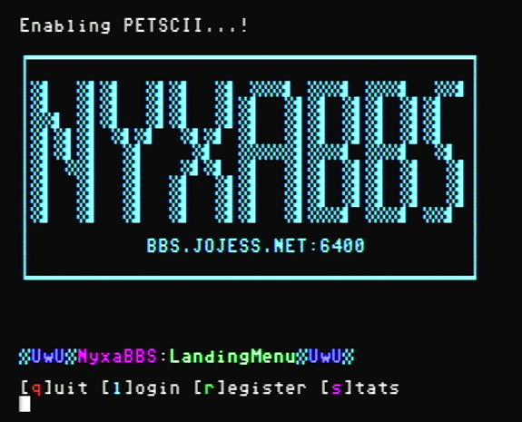
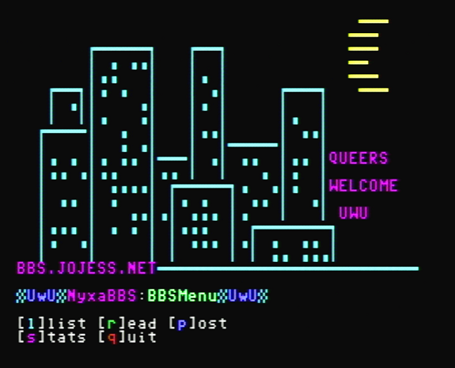
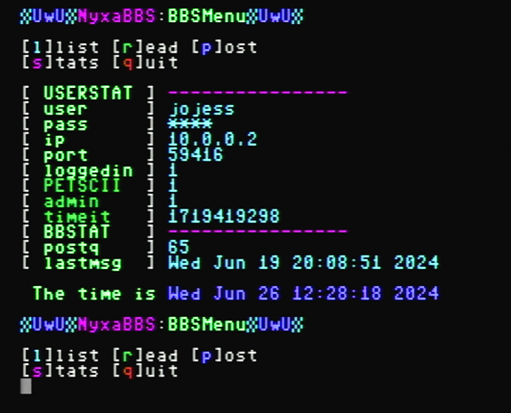

# NyxaBBS
Vulnerable PETSCII/C64 compatible perl BBS Daemon - just for fun, very wip

# TODO
* reformat character set 2 stuff for addition to the incomplete Text::Convert::PETSCII?
* cpan-ize
* MSG draft editor - maybe just no haha 
* MSG poster - add refresh message c64 via F5 or something - see draft editor
* lockfile mechanism for get/saveconf
* msg categories
* pms
* limit concurrent connections
* limit connections per IP 
* show / lookup by dates lol
* add common auto d/c ( a la menu_post 32 x nil quit ) 
* update PETSCiiHex2ASCII to use placeholder instead of dropping nonmatches?

# DEPENDS
* IO::Socket::INET - https://metacpan.org/pod/IO::Socket::INET
* Text::Convert::PETSCII - https://metacpan.org/pod/Text::Convert::PETSCII 
* JSON - https://metacpan.org/pod/JSON

# AUTHOR
jojessfournier nya gmail

# VERSION
Version 0.3 (2024-06-19)

# LICENSE
Available under terms of GPLv3 'cuz am lazy https://www.gnu.org/licenses/gpl-3.0.en.html

# SCREENCAPS

