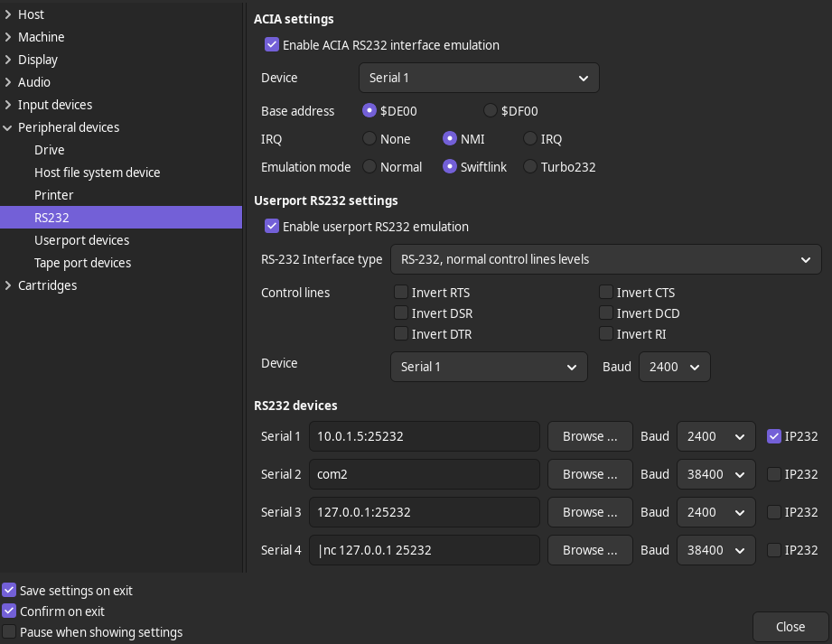
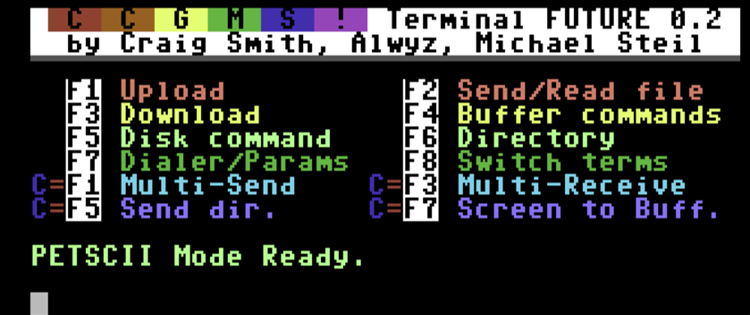
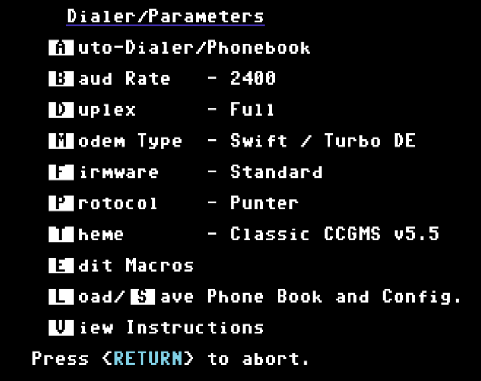
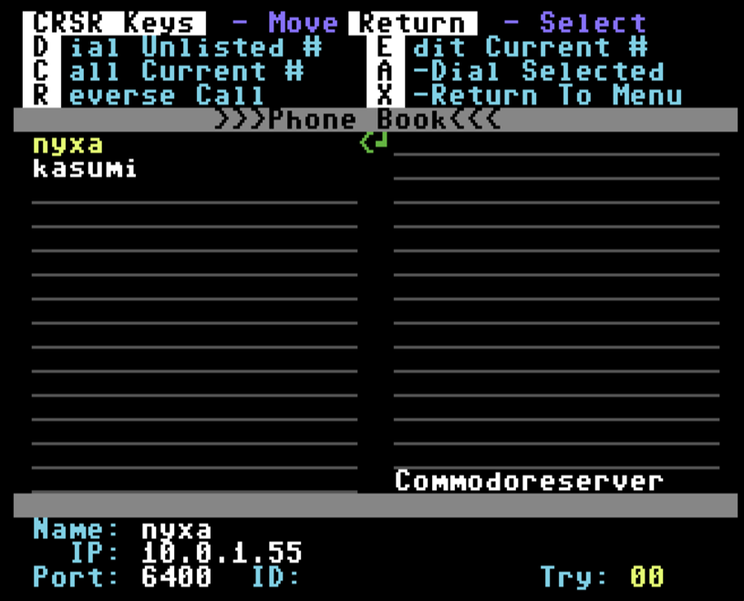

WHAT DA HECC
============
This is a guide on using VICE to connect to BBS servs over TPC.  Assumes you have VICE installed somewhere and a linux box with a tcpser binary to bridge your virtual serial modem with the net.

Vice RS232 Conf
===============



ccgms
-----
Using CCGMS 0.2





Here we have a 2400 baud modem ( CCGMS, tcpser, and VICE need to match ).  Modem Type = "Swift / Turbo DE" seems to work.  No other changes from the defaults. 




tcpser
------
NOTE:  Strongly recommend launching tcpser AFTER running CCGMS on VICE.  Otherwise one or the other with proly shit the bed / silently fail to communicate / spew whitespace.

I'm using a linux machine in this case, but windows or mac should do in a pinch.  Can be the same machine as your workstation, or just another host on your LAN.  Note that the LAN IP should be indicated in the VICE "RS232 devices" serial one field like {host}:25232, as in the screencap above.  We are listening for RS232 serial traffic coming in from tcp 25232, listening on tcp 6400, running at 2400 baud, and setting some verbosity.  "s5=20" is a modem init string I guess?  :3

```
tcpser -v 25232 -p 6400 -S 2400 -l 4 -i"s5=20"
```